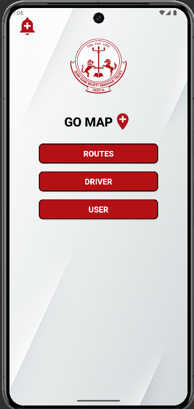
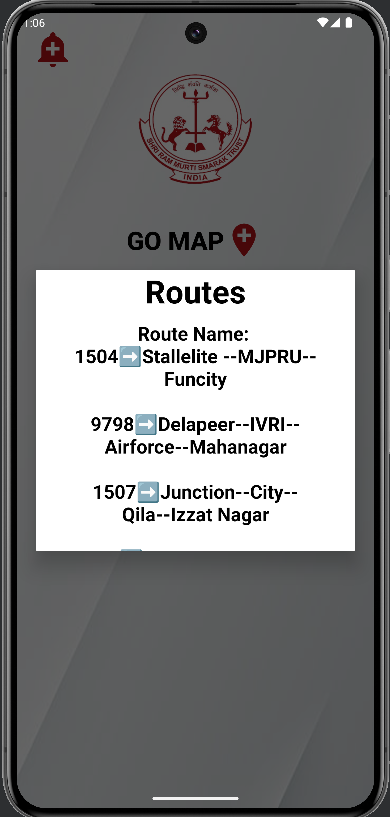
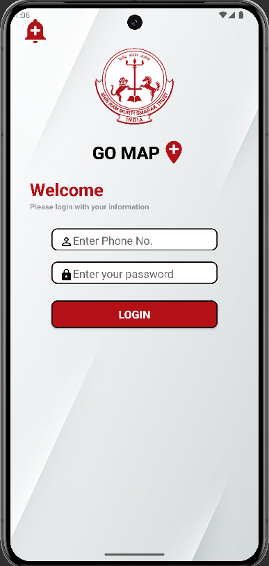
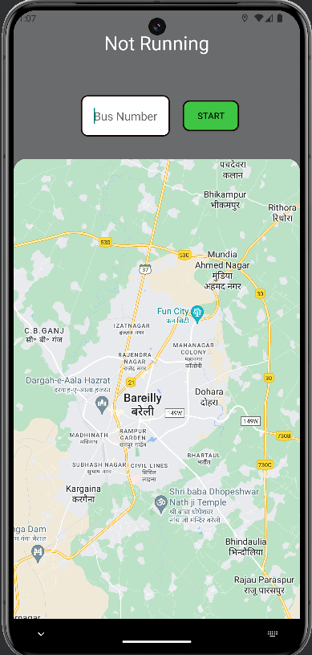
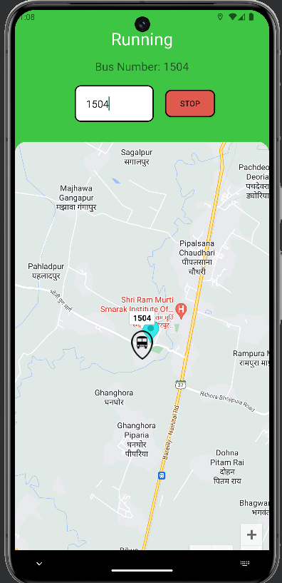
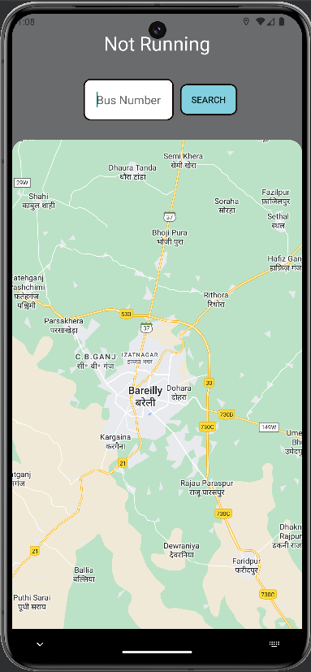

# Bus Tracking Application

Bus Tracking Application which uses mobile location of drivers to update the bus's current location and users can be informed.

## Features

- Routes - Drivers and Users can see the routes defined by administrator
- Driver Login - Easy login for drivers and simple UI to navigate through
- User - Users can easily locate their bus by simply entering bus no

## Screenshots

Some screenshots of project.
Main

Routes

Driver Login

Bus Not Running

Bus Running

User

## Installation
Clone the project and run apk

### Prerequisites

- Android Studio
- Minimum SDK version: Android 7
- Target SDK version: Android 14

### Steps

1. Clone the repository:
    ```bash
    git clone https://github.com/eren8204/bus-tracking_system.git
    ```
2. Open the project in Android Studio.
3. Build and run the project on your emulator or Android device.

## Usage

As of now it is for staff and students of SRMS CET, Bareilly. We're planning to launch it for other institutions too.

## Contact
If you have any questions, feel free to reach out to me at apskumar24@gmail.com.

## Acknowledgments
This project is in collaboration with https://github.com/ashish-maurya531 (Admin Web Panel Developer)
Check out his repo https://github.com/ashish-maurya531/Bus-Tracking-System
